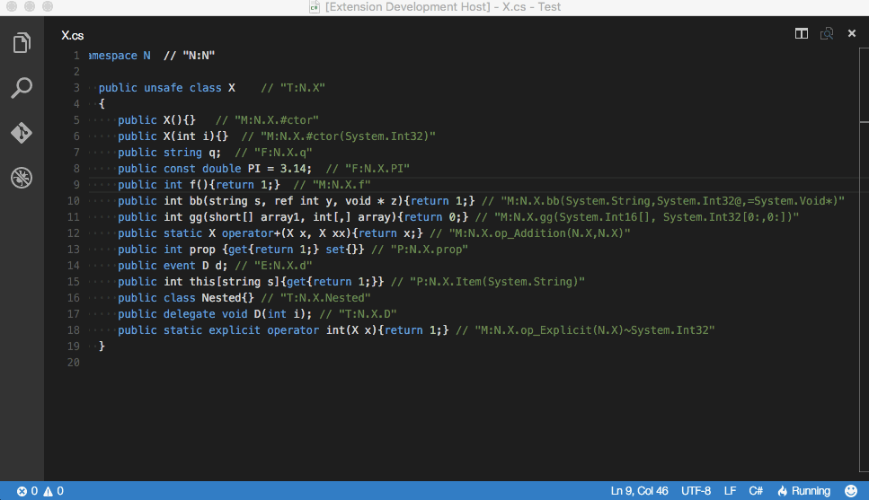

# XML Documentation Comments Support for Visual Studio Code

[](https://travis-ci.org/k--kato/docomment)
[](LICENSE)

Generate XML documentation comments for Visual Studio Code.


## Usage

Type "///", it auto-generates an XML doucumentation comment like this:




```csharp
/// <summary>
/// 
/// </summary>
/// <param name="s"></param>
/// <param name="y"></param>
/// <param name="z"></param>
/// <returns></returns>
public int bb(string s, ref int y, void * z)
{
    return 1;
}
```

## Installation

1. Install Visual Studio Code 0.10.6 or higher
1. Launch Code
1. From the command palette `Ctrl`-`Shift`-`P` (Windows, Linux) or `Cmd`-`Shift`-`P` (OSX)
1. Select `Install Extension`
1. Choose the extension '`docomment`' *or* run `ext install docomment`
1. Reload Visual Studio Code


## Supported Languages

- C#


## Contributing to the Code

Clone a copy of the repo:

```
git clone https://github.com/k--kato/docomment.git
```

### Building the code

First, install the package dependencies:

```
npm install
```

Now you can compile the code:

```
npm run compile
```

After the initial compile, the source files will be watched and recompiled
when changes are saved.


## License

This extension is [licensed under the MIT License](LICENSE.txt).
